# 🚀 Freelance Marketplace — Complete System Architecture & Interview Revision Guide

This guide is designed for **quick revision and in-depth interview preparation**. It breaks down the system architecture, database modeling, and every single feature implementation with **intuitive Mermaid flowcharts**, business logic explanations, API flow, and key interview talking points.

---

## 📑 Table of Contents
1. [High-Level Architecture & Tech Stack](#1-high-level-architecture--tech-stack)
2. [Database Schema & ERD (Entity Relationships)](#2-database-schema--erd-entity-relationships)
3. [Feature 1: Authentication & Role-Based Access Control (RBAC)](#3-feature-1-authentication--role-based-access-control-rbac)
4. [Feature 2: Client Project Creation & Skill Tagging](#4-feature-2-client-project-creation--skill-tagging)
5. [Feature 3: Project Discovery, Filtering & Pagination](#5-feature-3-project-discovery-filtering--pagination)
6. [Feature 4: Proposal Bidding & Validation System](#6-feature-4-proposal-bidding--validation-system)
7. [Feature 5: Proposal Review & Atomic Acceptance Lifecycle](#7-feature-5-proposal-review--atomic-acceptance-lifecycle)
8. [Feature 6: Contextual Chat & Messaging System](#8-feature-6-contextual-chat--messaging-system)
9. [Feature 7: Profile Management & Skills Taxonomy](#9-feature-7-profile-management--skills-taxonomy)
10. [Feature 8: Role-Aware Dashboard & Analytics](#10-feature-8-role-aware-dashboard--analytics)
11. [Top Interview Questions & Architectural Concepts](#11-top-interview-questions--architectural-concepts)

---

## 1. High-Level Architecture & Tech Stack

### 🏗️ 3-Tier Layered Architecture
The application is structured using standard clean architecture principles to ensure high cohesion, low coupling, and testability.

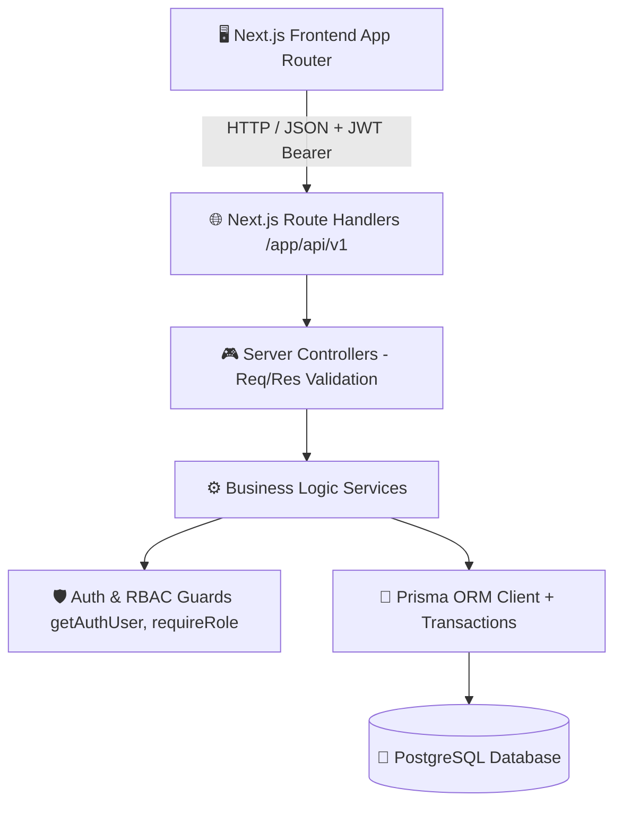

### 🛠️ Technology Stack Breakdown
| Layer | Technologies | Purpose |
| :--- | :--- | :--- |
| **Frontend UI** | Next.js 14 App Router, React, TailwindCSS, Lucide Icons | Responsive UI, Client Components, Dynamic State Management |
| **API Layer** | Next.js Route Handlers (`app/api/v1/...`) | RESTful API endpoints for auth, projects, proposals, chat, profile |
| **Business Logic** | TypeScript Controllers & Services (`src/lib/server/...`) | Decoupled business logic, validation, error handling |
| **Database & ORM** | PostgreSQL + Prisma ORM (`prisma/schema.prisma`) | Strongly-typed schema, migrations, relational queries & transactions |
| **Security & Auth** | JSON Web Tokens (`jsonwebtoken`), `bcryptjs` | Stateless session management, hashed credentials, role enforcement |

---

## 2. Database Schema & ERD (Entity Relationships)

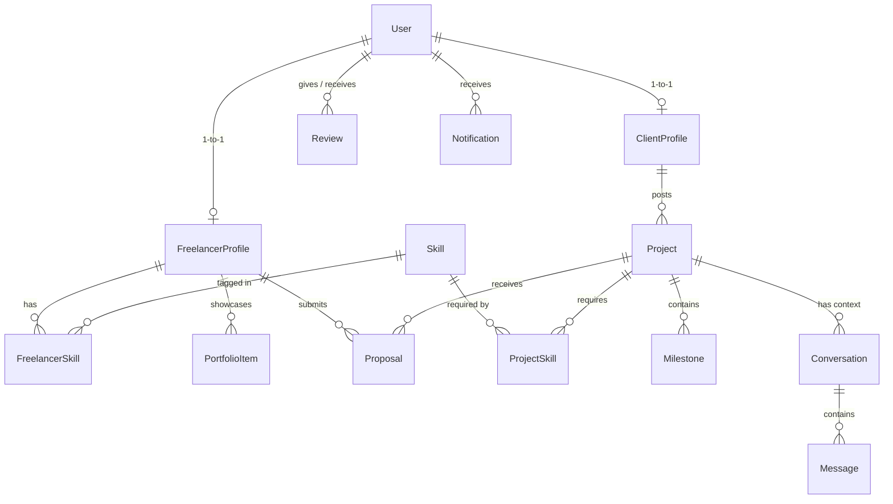

### 🔑 Key Database Highlights
* **Dual-Profile Polymorphism**: A single `User` table holds authentication credentials and has a 1-to-1 relationship with either `ClientProfile` or `FreelancerProfile`.
* **Many-to-Many Skill Taxonomy**: `Skill` is a normalized entity connected to both `FreelancerProfile` (via `FreelancerSkill`) and `Project` (via `ProjectSkill`) through composite primary keys `[freelancerId, skillId]` and `[projectId, skillId]`.
* **Unique Constraints**:
  - `@@unique([projectId, freelancerId])` on `Proposal` prevents a freelancer from submitting duplicate bids to the same project.
  - `@@unique([projectId, clientId, freelancerId])` on `Conversation` guarantees a single chat room per project negotiation.

---

## 3. Feature 1: Authentication & Role-Based Access Control (RBAC)

### 📌 Summary
Provides secure registration, login, JWT token issuance, and server-side RBAC protection (`CLIENT`, `FREELANCER`, `ADMIN`).

### 🔄 Registration & Login Flowchart
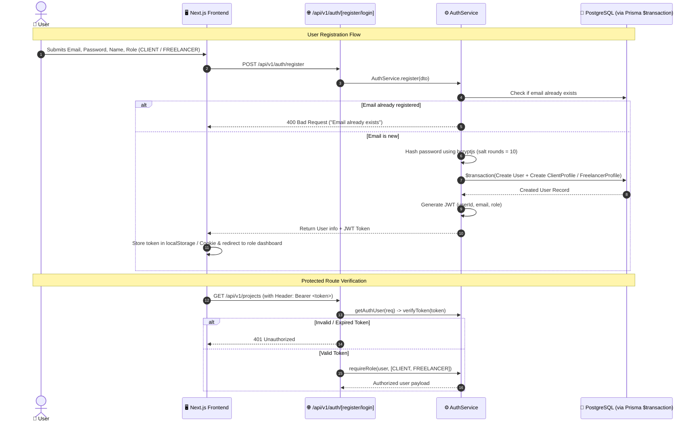

### 💡 Interview Questions & Answers
* **Q: Why use `prisma.$transaction` during user registration?**
  * **A:** User registration creates two records: the core `User` record and the role-specific `ClientProfile` or `FreelancerProfile`. Using a transaction ensures **atomicity**; if profile creation fails, the user record is automatically rolled back, preventing orphaned or broken accounts.
* **Q: How does RBAC guard endpoints?**
  * **A:** We use helper functions `getAuthUser(req)` to extract and verify the JWT payload, and `requireRole(user, allowedRoles)` to check if the user's role satisfies the endpoint permissions (e.g. only `CLIENT` can post a project).

---

## 4. Feature 2: Client Project Creation & Skill Tagging

### 📌 Summary
Allows clients to publish project job postings with budget, deadline, detailed description, and a list of required technical skills.

### 🔄 Project Creation Flowchart
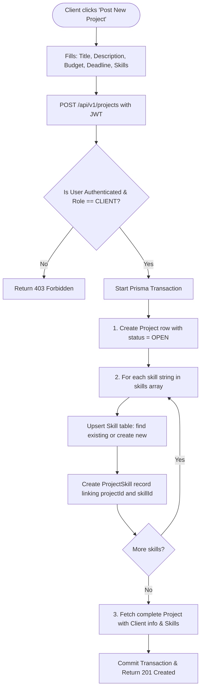

### 💡 Key Implementation Detail
* **Skill Upsert Logic:** Instead of hardcoding skill dropdowns, skills are upserted dynamically:
  ```typescript
  const skill = await tx.skill.upsert({
    where: { name: trimmedSkillName },
    update: {},
    create: { name: trimmedSkillName },
  });
  await tx.projectSkill.create({
    data: { projectId: project.id, skillId: skill.id },
  });
  ```
  This guarantees that skills are standardized and reused across projects and freelancer profiles.

---

## 5. Feature 3: Project Discovery, Filtering & Pagination

### 📌 Summary
Provides freelancers with a searchable, filterable feed of active job postings with server-side pagination.

### 🔄 Search & Query Flowchart
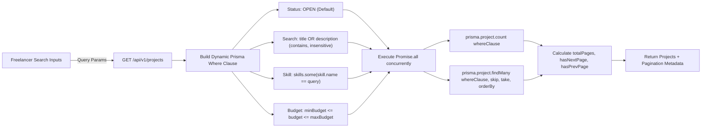

### 💡 Interview Questions & Answers
* **Q: How is pagination implemented efficiently?**
  * **A:** We calculate `skip = (page - 1) * limit` and `take = limit`. We execute the `count` query and `findMany` query in parallel with `Promise.all([prisma.project.count(...), prisma.project.findMany(...)])`, cutting API latency in half.
* **Q: How are search queries optimized in PostgreSQL?**
  * **A:** We created Prisma indexes on `[status]`, `[clientId]`, and `[createdAt]` in `schema.prisma` (`@@index([status])`, `@@index([createdAt])`) to ensure rapid filtering and sorting.

---

## 6. Feature 4: Proposal Bidding & Validation System

### 📌 Summary
Allows qualified freelancers to submit competitive bids on open projects with proposed budget, estimated turnaround time, and a tailored cover letter.

### 🔄 Proposal Submission Flowchart
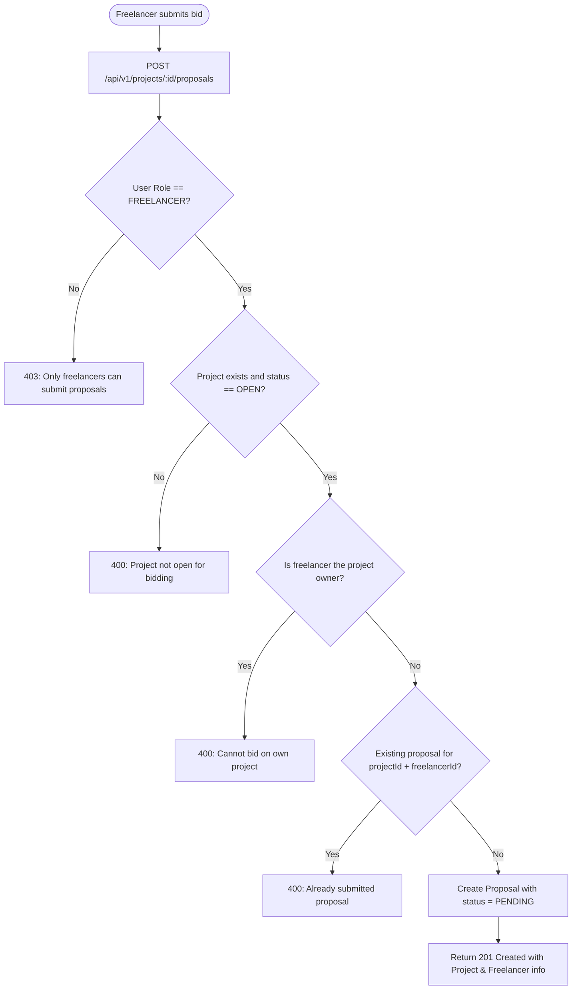

### 💡 Concurrency & Integrity Rule
* The database enforces `@@unique([projectId, freelancerId])`. Even under race conditions or double-clicks, the database rejects duplicate submissions with a unique constraint violation.

---

## 7. Feature 5: Proposal Review & Atomic Acceptance Lifecycle

### 📌 Summary
Clients review submitted proposals, shortlist candidates, or accept a winning bid. Accepting a proposal triggers an **atomic state machine transition**.

### 🔄 Proposal Status Lifecycle State Machine
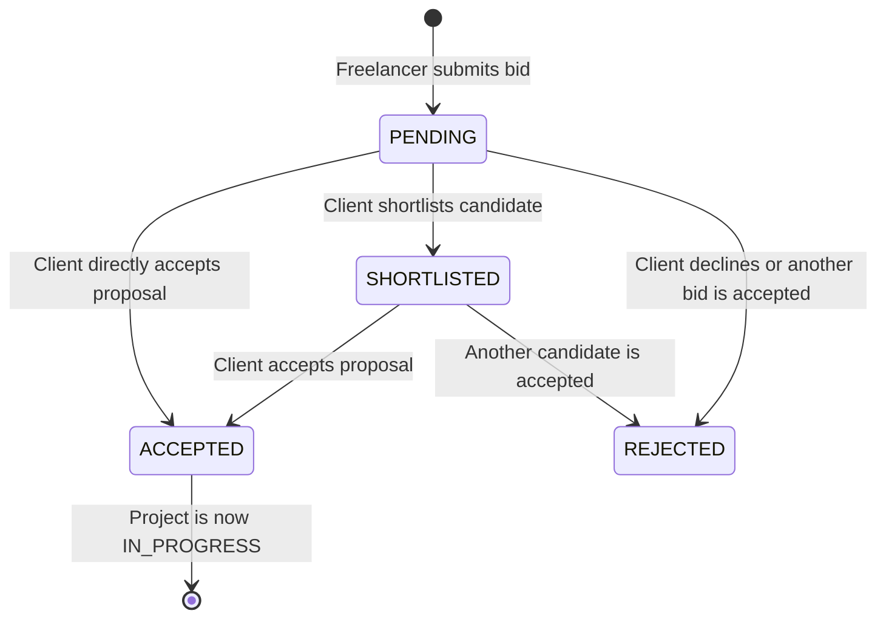

### 🔄 Atomic Proposal Acceptance Flowchart
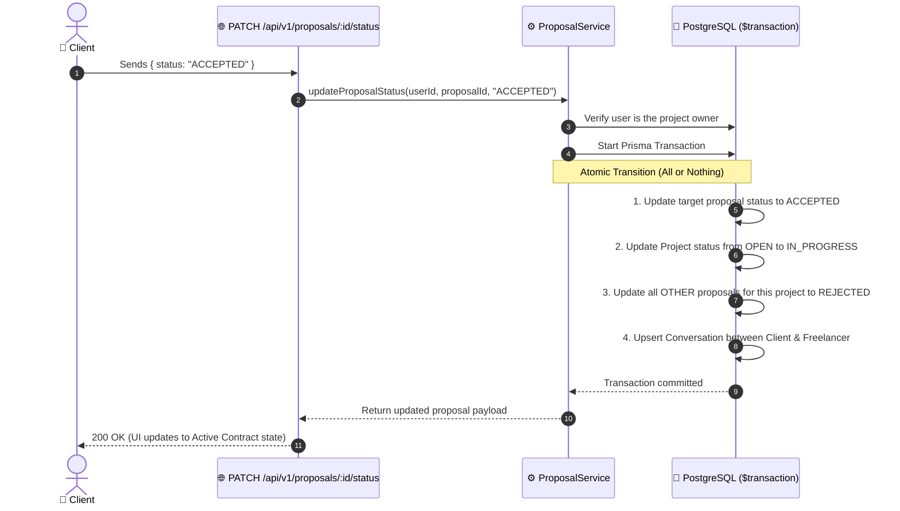

### 💡 Interview Questions & Answers
* **Q: Why must proposal acceptance be wrapped in a transaction?**
  * **A:** If step 1 (accept proposal) succeeds, but step 2 (update project status) or step 3 (reject other proposals) crashes, the system enters an inconsistent state where multiple proposals appear accepted or the project remains open. The transaction guarantees **ACID atomicity**.

---

## 8. Feature 6: Contextual Chat & Messaging System

### 📌 Summary
Provides dedicated direct messaging between clients and freelancers **attached to a specific project**. Access is strictly gated by proposal progression.

### 🔄 Messaging Security & Flowchart
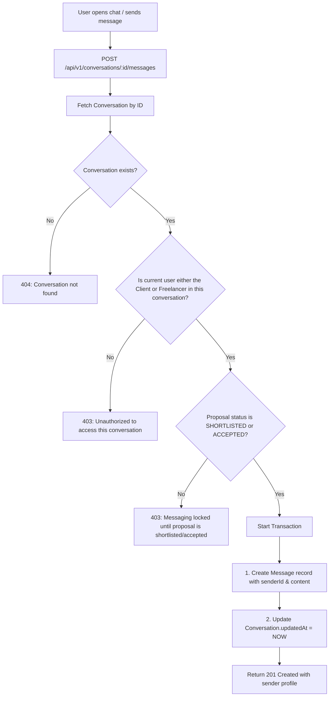

### 💡 Anti-Spam Business Rule
* Freelancers **cannot spam clients** upon submitting bids. Direct messaging is only unlocked once the client explicitly **shortlists** or **accepts** the freelancer's proposal.

---

## 9. Feature 7: Profile Management & Skills Taxonomy

### 📌 Summary
Supports distinct profiles for Clients (company name, website, description, location) and Freelancers (title, hourly rate, bio, experience years, skills, portfolio items).

### 🔄 Freelancer Skill & Portfolio Synchronization
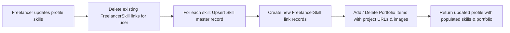

---

## 10. Feature 8: Role-Aware Dashboard & Analytics

### 📌 Summary
Provides dynamic aggregated metrics tailored to the authenticated user's role in a single optimized endpoint (`/api/v1/dashboard`).

### 📊 Metric Aggregation Breakdown
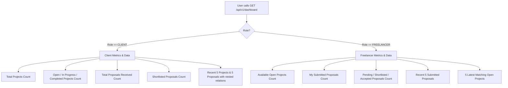

---

## 11. Top Interview Questions & Architectural Concepts

### 🎯 1. Architectural & Database Design
* **How did you prevent SQL Injection and Data Breaches?**
  * Prisma ORM uses parameterized queries exclusively, eliminating SQL injection vulnerabilities.
  * Passwords are never stored in plain text; they are salted and hashed with `bcryptjs`.
  * Sensitive fields like `password` are sanitized out before returning user DTOs to the client.

* **How do you handle relational cascading deletes?**
  * Configured `onDelete: Cascade` on child relations (e.g. deleting a `User` cascades to delete their `ClientProfile` / `FreelancerProfile`, `Projects`, `Proposals`, and `Messages`).

### 🎯 2. API & Error Handling
* **How is error handling centralized?**
  * A custom `AppError` class captures custom status codes (400, 401, 403, 404, 500).
  * Controllers wrap execution blocks in `try/catch` and standardize JSON error responses:
    ```json
    { "success": false, "error": "Descriptive error message" }
    ```

### 🎯 3. Performance & Scalability Considerations
* **Indexes:** Strategic composite indexes (`@@index([email])`, `@@index([status])`, `@@index([createdAt])`, `@@index([recipientId, isRead])`) minimize table scan overhead.
* **Non-blocking parallel queries:** Using `Promise.all` across independent database lookups drastically reduces API response times.
* **Separation of Concerns:** 
  - `Route Handlers` deal with HTTP headers and route params.
  - `Controllers` validate input types and payload schemas.
  - `Services` encapsulate business logic, domain rules, and DB transactions.
  - `Prisma` handles data persistence and relational mapping.

---
⭐ *Tip for the Interview: When explaining features, start with the business problem, describe the data entity relationships, mention the security guard rails (RBAC & validations), and highlight the transaction integrity (`$transaction`).*
